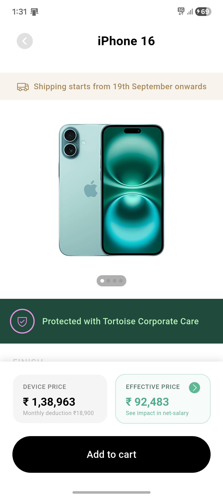
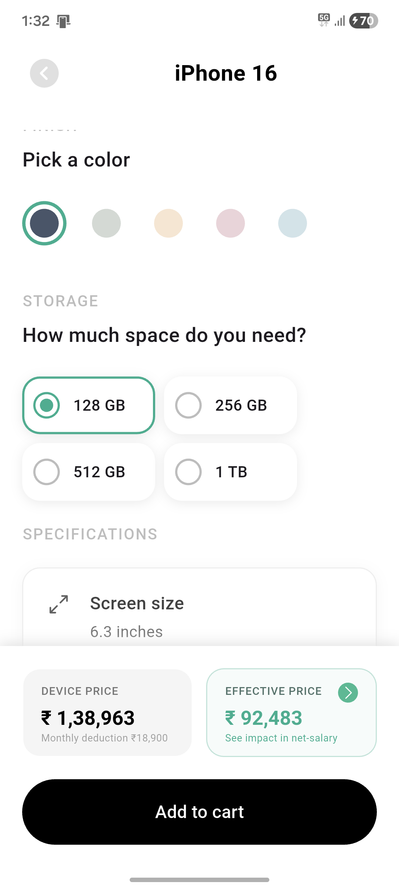
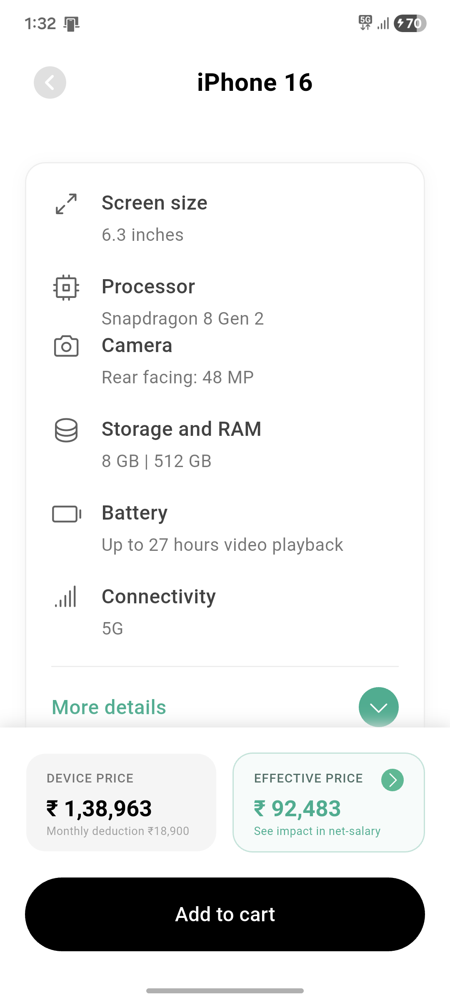

# Tortoise Assignment - Device Catalog App

A Flutter e-commerce application showcasing premium devices from Apple, Google, Samsung, and OnePlus. Features include brand filtering, product search, detailed product views with color/storage selection, pricing, shipping information, and an intuitive bottom sheet interface for price breakdowns.

## Screenshots

### Home Screen - Device Catalog


### Product Detail Page




### Price Breakdown


## Features

- 📱 Multi-brand device catalog (Apple, Google, Samsung, OnePlus)
- 🔍 Search functionality with brand filtering
- 🎨 Color and storage variant selection
- 💰 Dynamic pricing with detailed breakdowns
- 🚚 Shipping information and delivery estimates
- 📊 Product specifications display
- 🎯 Clean, modern UI with custom widgets

## Getting Started

### Prerequisites

- Flutter SDK (^3.9.2)
- Dart SDK
- Android Studio / VS Code
- Android Emulator or Physical Device

### Installation

1. Clone the repository
```bash
git clone https://github.com/Rohit-Chandra-007/tortoise_assignment.git
cd tortoise_assignment
```

2. Install dependencies
```bash
flutter pub get
```

3. Run the app
```bash
flutter run
```

## Project Structure

```
lib/
├── main.dart
├── pages/
│   ├── device_catalog.dart
│   └── product_detail_page.dart
└── widgets/
    ├── brand_selector.dart
    ├── color_picker_section.dart
    ├── custom_app_bar.dart
    ├── custom_button.dart
    ├── dash_divider.dart
    ├── effective_price_bottom_sheet.dart
    ├── price_bottom_sheet.dart
    ├── price_description_slab.dart
    ├── product_card.dart
    ├── product_image_section.dart
    ├── product_specifications.dart
    ├── search_bar_with_chip.dart
    ├── shipping_banner.dart
    └── storage_selector_section.dart
```

## Dependencies

- `google_fonts` - Custom typography
- `phosphor_flutter` - Icon library

## Assets

The app includes product images and data stored in:
- `assets/brands/` - Brand logos
- `assets/devices/` - Product images
- `assets/data/products.json` - Product catalog data

---

Built with Flutter 💙
